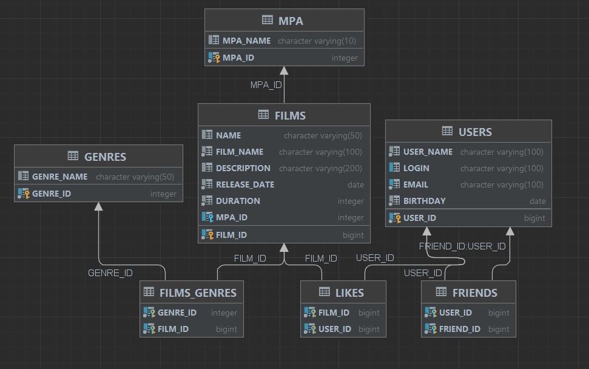

# java-filmorate
Template repository for Filmorate project.

# Схема базы данных



## Справочники для заполнения базы данных

### Жанры фильмов
```postgresql
merge into GENRES(GENRE_ID, GENRE_NAME)
values(1, 'Комедия'), (2, 'Драма'), (3, 'Мультфильм'),
(4, 'Трилер'), (5, 'Документальный'), (6, 'Боевик');
```

### Рейтинги фильмов
```postgresql
merge into mpa(mpa_id, mpa_name)
    values(1, 'G'), (2, 'PG'), (3, 'PG-13'), (4, 'R'), (5, 'NC-17');
```

### Расшифровка рейтингов: 
    G — у фильма нет возрастных ограничений,
    PG — детям рекомендуется смотреть фильм с родителями,
    PG-13 — детям до 13 лет просмотр не желателен,
    R — лицам до 17 лет просматривать фильм можно только в присутствии взрослого,
    NC-17 — лицам до 18 лет просмотр запрещён.